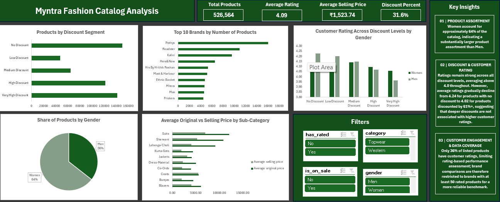

# Myntra Fashion Catalog Analysis
An Excel-based analysis of Myntra's fashion catalog covering product assortment, pricing, discounts, customer ratings, brands, and gender-wise distribution.

## Overview
This project analyzes Myntra's fashion catalog to understand the composition of products, pricing patterns, discount levels, customer rating coverage, and brand presence.
The analysis was performed using Microsoft Excel through data cleaning, PivotTables, PivotCharts, and dashboard visualization.
The final dashboard brings the major findings together into a business-focused view of the catalog.

## Problem Statement
The objective of this analysis is to understand Myntra's fashion product assortment and identify meaningful patterns in:
- Product distribution by gender
- Product distribution across discount segments
- Brand-level product presence
- Original price versus selling price
- Customer rating coverage
- Customer ratings across discount levels
- Category and subcategory pricing
The analysis aims to convert a large product catalog into meaningful insights that can help understand product assortment, pricing, discounting, and customer engagement patterns.

## Dataset
The original dataset includes:
- `product_id`
- `brand_name`
- `category`
- `individual_category`
- `category_by_gender`
- `discount_price (in Rs)`
- `original_price (in Rs)`
- `discount_offer`
- `size_option`
- `ratings`
- `reviews`

### Calculated Fields
Additional analytical fields were created in Excel to support pricing, discount, rating, and sales analysis:
- `offer_rs`
- `offer_pct`
- `selling_price`
- `discount_percent`
- `has_rated`
- `is_on_sale`
- `discount_segment`

These calculated fields were derived from the available product information and were used for analysis, PivotTables, PivotCharts, dashboard filters, and visualizations.

### Dataset File
`data/Myntra_Cleaned_Data.xlsx`

The Excel workbook contains the cleaned data along with the PivotTables and PivotCharts used for the analysis.

## Tools & Technologies
- Microsoft Excel
- Excel Formulas
- Data Cleaning
- PivotTables
- PivotCharts
- Data Visualization

## Methods
The analysis was performed through the following steps:
1. Cleaned and prepared the original Myntra fashion catalog data.
2. Reviewed product, category, pricing, discount, rating, and review fields.
3. Created `offer_rs` and `offer_pct` to analyze offer values.
4. Created `selling_price` for pricing analysis.
5. Calculated `discount_percent` to measure the percentage discount applied to products.
6. Created `has_rated` to identify products with available customer ratings.
7. Created `is_on_sale` to identify products available on sale.
8. Created `discount_segment` to group products into different discount ranges.
9. Analyzed product distribution by gender.
10. Analyzed products across discount segments.
11. Identified the top brands by number of products.
12. Compared average original price and selling price across subcategories.
13. Compared customer ratings across discount levels and genders.
14. Created PivotTables and PivotCharts.
15. Built the final Excel dashboard with interactive filters.

## Key Insights
### 01 | Product Assortment
Women account for approximately **64%** of the catalog, while men account for approximately **36%**, indicating a substantially larger product assortment for women.

### 02 | Discount & Customer Rating
Customer ratings remain strong across discount levels, averaging above **4.0** throughout. However, average ratings gradually decline from approximately **4.24** for products with no discount to approximately **4.02** for products with discounts of 61% or more.
This suggests that deeper discounts are not associated with higher customer ratings in this catalog.

### 03 | Customer Engagement & Data Coverage
Only approximately **36%** of listed products have customer ratings. This limits rating-based performance assessment and means brand comparisons are more reliable for brands with sufficient rated products.

### 04 | Product & Brand Distribution
The catalog contains a wide range of brands, with a relatively small group of brands accounting for a substantial number of listed products.

### 05 | Pricing Variation
Average original and selling prices vary considerably across subcategories, highlighting differences in pricing and discounting strategies across the fashion catalog.

## Dashboard
The final dashboard provides a consolidated view of:
- Total products
- Average customer rating
- Average selling price
- Average discount percentage
- Products by discount segment
- Top 10 brands by number of products
- Customer rating across discount levels by gender
- Product share by gender
- Average original versus selling price by subcategory
- Interactive filters for rating availability, category, sale status, and gender

## Result & Conclusion
The analysis provides a structured view of Myntra's fashion catalog and highlights important patterns in product assortment, pricing, discounting, customer ratings, and brand presence.
The dashboard shows that women-focused products form the larger share of the catalog, while customer rating coverage remains limited. Ratings remain relatively strong across discount levels, although average ratings show a gradual decline as discounts become deeper.
Overall, this project demonstrates how Excel can be used to clean a large dataset, perform business-focused analysis, identify meaningful patterns, and communicate insights through an interactive dashboard.

## Author
**Kajal Gaud**

Final Year B.Tech Computer Science And Engineering Student 
Aspiring Data Analyst

### Contact
LinkedIn: www.linkedin.com/in/kajal-gaud-30798331a
Email: kgaud252@gmail.com
